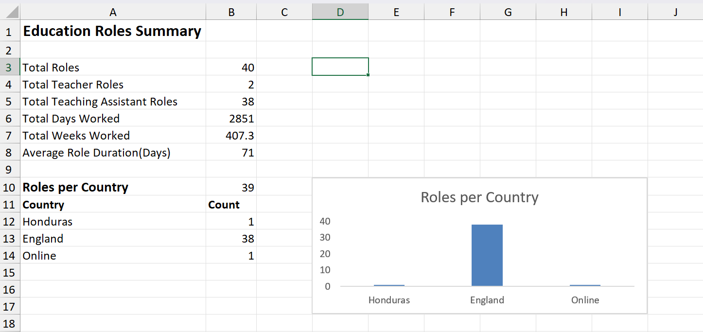
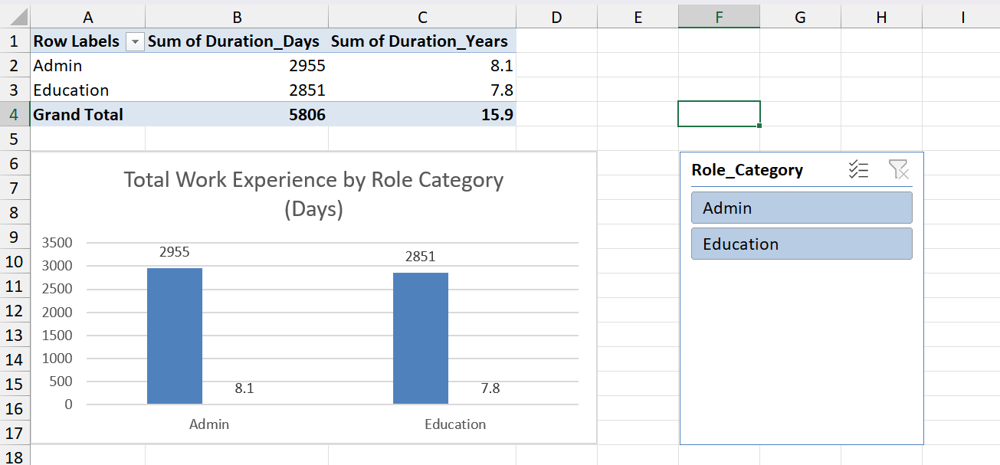

# Excel Work Experience Analysis

## Overview

This project demonstrates my ability to clean, structure, and analyse a dataset of work experience using Microsoft Excel.

The dataset tracks anonymised roles across education and administrative fields, including role type, location, and duration. The project evolved from basic data organisation to structured analysis using PivotTables and visualisation techniques.

---

## Project Evolution

### 🔹 Version 1: Data Structuring & Cleaning

* Cleaned and organised raw data into a structured database
* Standardised role and location fields
* Developed dynamic formulas to calculate role durations(days, weeks, months)
* Created summary metrics for total experience and role analysis
* Developed a country-level breakdown using COUNTIF formulas

### 🔹 Version 2: Data Analysis & Visualisation

* Introduced a new `Role_Category` field to group roles (Education vs Admin)
* Built PivotTables to aggregate total experience by category
* Created a calculated field to convert duration from days to years
* Designed a PivotChart to visually compare experience
* Added a slicer for interactive filtering

---

## Key Insights

* **Admin Experience:** ~8.1 years
* **Education Experience:** ~7.8 years

This analysis highlights a balanced professional background across administrative and education roles, with slightly more experience in administrative work.

---

## Skills Demonstrated

* Data cleaning and anonymisation
* Structured Tables and references
* Dynamic formulas (COUNTIF, SUM, AVERAGE, IF, DATEDIF)
* PivotTables and aggregation
* Calculated fields
* Data categorisation
* Data visualisation (PivotCharts)
* Dashboard-style layout design

---

## Tools Used

* Microsoft Excel
* Structured Tables
* PivotTables
* PivotCharts
* Slicers

---

## File Structure

* `v1-basic-tracking/` → Initial dataset and structured tracking
* `v2-pivot-analysis/` → Enhanced analysis with PivotTables and visualisation

---

## Purpose

This project was created as part of building practical Excel and data analysis skills to support my transition into administrative, operations, and entry-level data roles.

It demonstrates my ability to move from raw data to structured insights and present findings clearly.

## Project Preview

### Version 1: Data Structuring & Cleaning

### Version 2: Pivot Analysis & Visualisation

